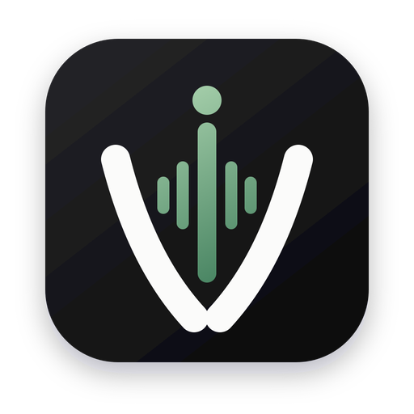

<div align="center">
  

  # Voicetypr

  **Offline-first voice-to-text dictation for macOS and Windows.**

  Speak in any app. Voicetypr transcribes your voice and places the result at your cursor.

  [](https://github.com/moinulmoin/voicetypr/releases/latest)
  [](LICENSE)
  [](https://voicetypr.com/download)
  [](https://voicetypr.com/download)
  [](https://github.com/moinulmoin/voicetypr/releases)

  [Website](https://voicetypr.com) · [Download](https://voicetypr.com/download) · [Changelog](https://voicetypr.com/changelog) · [Help](https://voicetypr.com/help)
</div>

## Overview

Voicetypr is an open-source desktop dictation app built with Tauri, Rust, and React. Use a global shortcut to record, transcribe locally or through an optional cloud provider, format the result, and insert it into the app you are already using.

Local transcription is the default. After the trial, a lifetime license keeps local models unmetered: no subscription, per-minute API fee, or cloud usage quota. Optional cloud modes still use the selected provider's billing and limits.

## Features

- **Dictate anywhere:** system-wide shortcuts, push-to-talk, toggle recording, and automatic insertion at the active cursor.
- **Local transcription:** Whisper on macOS and Windows, plus Apple Silicon-optimized Parakeet models on macOS.
- **Optional cloud speech-to-text:** Soniox, OpenAI, Groq, Deepgram, and Cohere.
- **AI formatting:** clean up rough dictation with OpenAI, Anthropic, Gemini, or a custom OpenAI-compatible endpoint.
- **File transcription:** transcribe audio and video files, with supported cloud providers offering speaker diarization.
- **Transcript history:** search, filter, inspect metadata, compare original and formatted text, copy, save, or re-transcribe.
- **Network Sharing:** use another Voicetypr installation as a private transcription server on your LAN or configured network.
- **Agent-ready CLI:** give scripts and local AI agents audio-to-text and microphone capture with plain-text or structured JSON output.
- **Release channels:** choose Stable or Beta updates. Microsoft Store installations remain Store-managed.
- **Native performance:** a small React interface backed by Rust audio, transcription, hotkey, and insertion pipelines.

## Command-line interface

Voicetypr's CLI gives scripts and AI agents access to local transcription: audio in, plain text or structured JSON out. With a lifetime license and a local model, there are no per-minute API fees or cloud usage quotas.

Install the `voicetypr` command from **Settings → Advanced**, then use it from an agent or terminal:

```bash
voicetypr --help
voicetypr status --json
voicetypr models --json
voicetypr transcribe --file note.wav --json
voicetypr record --until-silence --json
```

Human-readable output is the default. Add `--json` for structured automation output. Audio stays on the machine unless the command explicitly selects a remote Voicetypr server.

## Privacy and data flow

Voicetypr is offline-first, but the selected mode determines what leaves your computer:

| Mode | Data flow |
| --- | --- |
| Local transcription | Recorded audio and transcription stay on the device. Model files are downloaded once and stored locally. |
| Cloud transcription | Recorded audio is sent to the cloud speech-to-text provider you selected. |
| AI formatting | The transcript is sent to the AI provider you configured for rewriting. |
| Network Sharing | Audio is sent to the Voicetypr server you explicitly configured. |

Diagnostics and product-analytics controls are available in Settings. See the [Privacy Policy](https://voicetypr.com/privacy) for the current collection and retention details.

## Installation

### macOS

Requirements: macOS 14 or later, Apple Silicon or Intel, microphone permission, and Accessibility permission for cursor insertion.

1. Download the latest macOS package from [voicetypr.com/download](https://voicetypr.com/download) or [GitHub Releases](https://github.com/moinulmoin/voicetypr/releases/latest).
2. Open the DMG and move Voicetypr to Applications.
3. Launch the app, grant the requested permissions, and download a transcription model.

Release builds are signed and notarized by Apple.

### Windows

Requirements: 64-bit Windows 10 build 19041 or later, or Windows 11.

Choose either distribution:

- [Direct installer](https://voicetypr.com/download) — updated through Voicetypr's Stable or Beta channel.
- [Microsoft Store](https://apps.microsoft.com/detail/9p8j3x9b2jg6) — updated through the Store.

Windows can use the bundled CPU transcription path on every supported machine. Optional Vulkan acceleration runs in an isolated sidecar process and falls back to CPU if the GPU path is unavailable.

## Quick start

1. Open Voicetypr and choose a local or cloud transcription model.
2. Set the primary recording shortcut in General settings.
3. Place the cursor in any text field.
4. Press the shortcut, speak, and stop recording.
5. Voicetypr inserts the transcript at the cursor and stores it in local history.

## Architecture

| Layer | Technology and responsibility |
| --- | --- |
| Desktop shell | Tauri v2 windowing, menus, updater integration, permissions, and packaging |
| Frontend | React 19, TypeScript, Tailwind CSS, shadcn/ui, and Zustand |
| Backend | Rust recording, resampling, transcription orchestration, hotkeys, history, and cursor insertion |
| Local engines | Whisper on macOS and Windows; Parakeet sidecar on Apple Silicon |
| Windows GPU isolation | Optional Vulkan Whisper sidecar; the main executable remains CPU-safe |
| Network Sharing | Authenticated Voicetypr server/client for remote transcription |

## Build from source

Prerequisites:

- Node.js and pnpm
- Rust stable toolchain
- Tauri v2 platform prerequisites for your operating system
- Xcode command-line tools on macOS or Visual Studio Build Tools on Windows

```bash
git clone https://github.com/moinulmoin/voicetypr.git
cd voicetypr
pnpm install
pnpm tauri:dev
```

Useful checks:

```bash
pnpm lint
pnpm typecheck
pnpm test
pnpm test:backend
pnpm check
```

See [`AGENTS.md`](AGENTS.md) and [`CLAUDE.md`](CLAUDE.md) for repository conventions and architecture notes.

## Contributing and support

- Report reproducible bugs through [GitHub Issues](https://github.com/moinulmoin/voicetypr/issues).
- Use the in-app **Report a problem** page when logs and system configuration would help diagnosis.
- Review existing issues and pull requests before starting overlapping work.
- Keep platform-specific behavior explicit and preserve the CPU-safe main-process invariant on Windows.

## License

Voicetypr source code is licensed under the [GNU Affero General Public License v3.0](LICENSE).
